# theaihatch

theaihatch is a local, open-source AI coding workspace that records agent work as a human-speed, seekable animation. The bundled fixture runs without an API key or an LLM call.



## Install and run

Requires Node 22.

```sh
npm install
npm run dev --workspace @theaihatch/server
npm run dev --workspace @theaihatch/web
```

Open the Vite URL, use the fixture transport controls, or open a local folder and run the scripted workspace demo.

Provider keys are stored in the operating-system keychain. The provider layer is separate from MCP: providers access models, while MCP exposes tools and context. See `SECURITY.md` before connecting a local MCP server.

## Development

```sh
npm run typecheck
npm run lint
npm run test
npm run build
```

The supported provider path is OpenAI followed by Anthropic; Gemini is intentionally not included in this build. OpenAI-compatible endpoints can be configured with a base URL and manual model name.

## License

Apache-2.0. See `CONTRIBUTING.md` and `SECURITY.md` for project processes.
